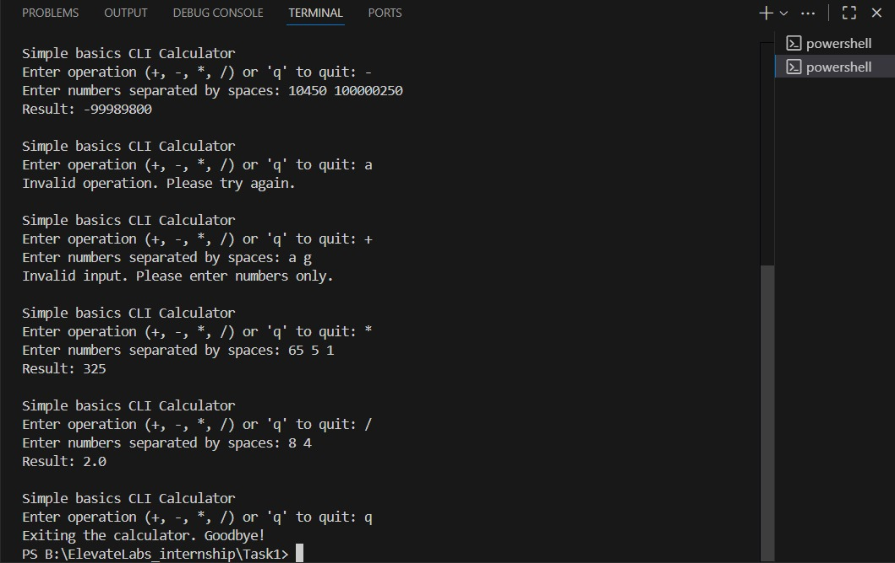

# 🧮 Task 1 – Calculator CLI App

## 📘 Objective  
Build a simple command-line calculator that performs basic arithmetic operations using Python.

---

## 🛠️ Tools  
- Python  
- VS Code  
- Terminal  

---

## 📂 Deliverable  
- `calculator_cli_app.py`

---

## ⚙️ Features  
- Addition  
- Subtraction  
- Multiplication  
- Division  

---

## 🚀 How to Run  
1. Open the terminal in the task folder.  
2. Run the Python file using:  
   ```bash
   python calculator_cli_app.py
---

## 🎯 Sample Outputs:

 



