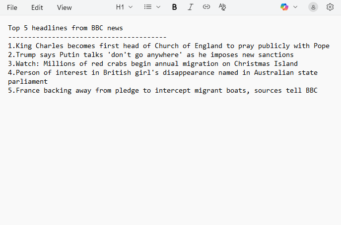
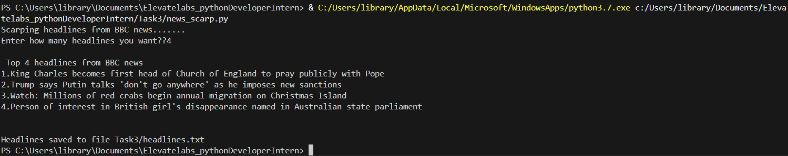
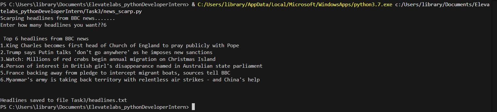

# BBC News Headline Scraper  
A simple Python script that scrapes the **latest BBC News headlines** and displays the **top N** in the console. The headlines are also saved to a text file (`headlines.txt`).  

## Features  
- **Scrape Headlines:** Fetches the latest BBC News headlines directly from [bbc.com/news](https://www.bbc.com/news).  
- **Top N Results:** Displays only the top N headlines for quick reading.  
- **Save to File:** Automatically saves the top N  headlines to a text file (`headlines.txt`).  
- **Error Handling:** Includes basic exception handling and stack trace logging for debugging.  

## Files  
- `news_scarp.py`: Main Python script that scrapes and saves headlines.  
- `headlines.txt`: Generated automatically to store the top N BBC headlines.  

## Requirements  
- Python 3.x  
- Libraries:  
  - `requests`  
  - `beautifulsoup4`  

You can install dependencies using:  
 ` pip install requests beautifulsoup ` 

## Example Output  

### Console Output  

