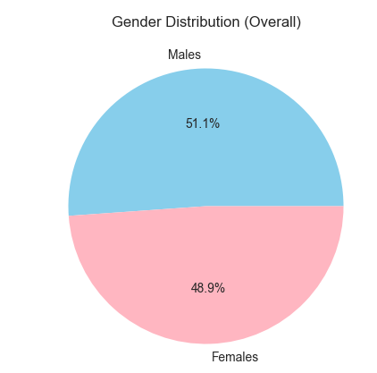

# 🧩 Education Data Analysis using Python and Pandas

## 📘 Project Overview
This project performs **data analysis on educational institution data** using **Python, Pandas, and Matplotlib/Seaborn**.  
The dataset contains details of schools, their types, and student enrollments (male, female, and total) across different grades.  

The main goal is to **analyze enrollment patterns** across **school types**, **education sectors**, and **gender**, and to visualize the findings.

---

## 🎯 Objective
To analyze and visualize education data stored in a CSV file to derive insights such as:
- Which **education sector** (e.g., Catholic, Government, etc.) has the most students.
- Which **school type** (Primary, Secondary, etc.) dominates in student enrollment.
- What the **gender distribution** among students looks like.
- How enrollment varies across **school numbers**.

---

## 🧰 Tools & Libraries Used
| Tool | Purpose |
|------|----------|
| **Python 3** | Programming language |
| **Pandas** | Data cleaning and analysis |
| **Matplotlib** | Plotting and visualization |
| **Seaborn** | Enhanced data visualization |
| **Jupyter Notebook / Google Colab** | Interactive analysis environment |

---

## 📂 Dataset Details

**File:** `education_data.csv`  

### Example Columns:
| Column Name | Description |
|--------------|-------------|
| `Education_Sector` | Sector of the school (Catholic, Government, etc.) |
| `Entity_Type` | Entity type code |
| `School_No` | Unique school identification number |
| `School_Name` | Name of the school |
| `School_Type` | Primary / Secondary / Combined |
| `School_Status` | Operating status (O = Open, C = Closed) |
| `Year 12 Males` | Number of male students in Year 12 |
| `Year 12 Females` | Number of female students in Year 12 |
| `Grand Total` | Total number of students enrolled in the school |

---

