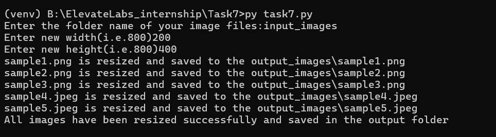

# Task 7: Image Resizer Tool

## Objective
Develop a Python script to **resize and convert images in batch**.  
This tool takes an **input folder** containing images, resizes them to a user-defined width and height, and saves them in a new **output folder (outside the input folder)** while keeping the **same image format** as the original.

---

## Tools & Technologies
- **Language:** Python  
- **Library:** Pillow (`PIL`)  
- **Modules Used:** `os`, `PIL.Image`

---

## Features
✅ Resize all images in a folder automatically  
✅ Keeps the original image format (JPG, PNG, JPEG)  
✅ Automatically creates an output folder outside the input folder  
✅ Works on **Windows**, **Linux**, and **macOS**  
✅ Simple and efficient batch processing

---

## Folder Structure

``` text 
task7/
│
├── task7.py # Main Python script
├── input_images/ # Folder containing original images
└── output_images/ # Automatically created folder for resized images

```

## Sample outputs


### Execution:



### Before Resized


### After Resized

