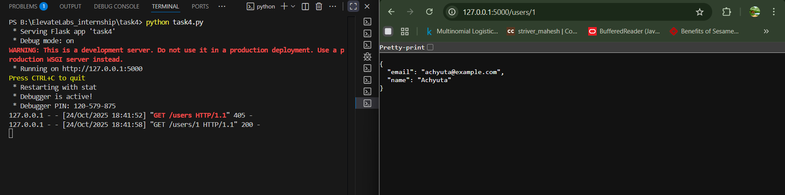
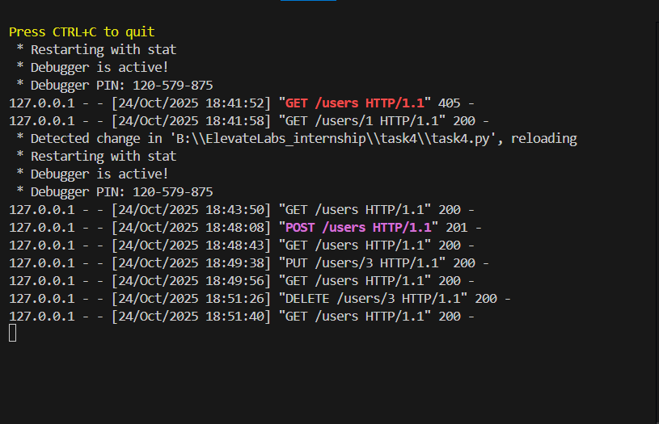

# Build a REST API with Flask
API development fundamentals

## Create a REST API that manages user data.

## Tools
- python
- flask
- Curl

## Deliverables
  Flask app with GET/POST/PUT/DELETE routes

## Files
-   `task4.py`: Main Python script.
## Example

